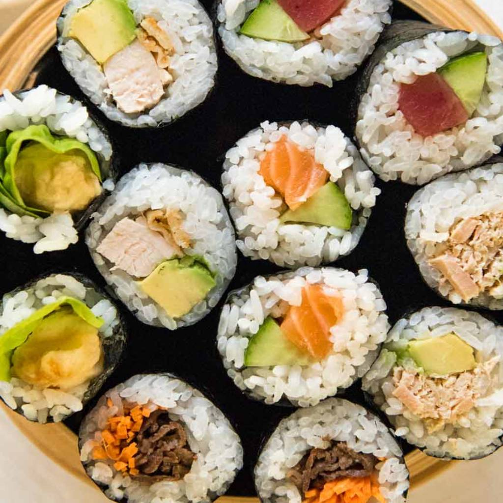

# Recipes

This is where I collect recipes. 

----

## Tomato sandwich

It's cheap, it's filling, it's easy. 

### Ingredients

- Bread
- Tomatoes
- Salt
- Mayonaise
- Spices as you see fit

### Instructions

Toast the bread.

Slice the tomato. Typically one per sandwich.

Once bread is toasted, spread mayo on bread. 

Put tomatoes on bread. then salt tomatoes. 

----

## None pizza with left beef

 Pizza = none. Beef = left

### Ingredients

- Pizza dough
- cooked beef

### Instructions

Cook pizza dough. Do not add sauce. 

Add beef to left side of cooked pizza dough. Beef is only for the left side, do not put anywhere else. 

----

## Nachoes

 Cheese + chips = tasty

### Ingredients

- Tortilla chips
- Daiya cheese
- chopped veggies
- cooked ground meat

### Instructions

Put chips on a plate. 

Put chopped veggies and ground meat on top of chips. 

Put Daiya cheese on top. 

Cook in microwave for 2 minutes. 

Serve with salsa.

----

## Curry

 Veggies and sauce cooked deliciously. 

### Ingredients

- Curry mix
- Peppers
- Onions
- Coconut milk
- Spices
- Oil

### Instructions

Put oil in a saucepan. Put onions in and cook for 1 minute. 

Then add spices and curry mix. Cook for another minute. 

Add coconut milk and mix until all ingredients are thoroughly mixed. 

Then add peppers and cook until cooked through. 

---

## Sushi

### Ingredients

- Calrose or other sticky rice
- Sushi seasoning powder mix powder
	- Or combine rice vinegar, salt, and sugar
- Seaweed wrap (nori)
- Wasabi or horseraddish
- Fillings of choice, e.g.
	- Vegetables: avocado, cucumber, carrots
	- Meat: tuna, crab, chicken
	- Extras: green onions, cream cheese
	- Toppings: sriracha, unagi sauce, mayonnaise, sesame seeds

### Instructions

Cook rice according to its instructions. You may need to wash the rice one or more times (until the water runs clear).

Slice fillings into narrow strips

etc

----

## Healing Potion

For when your health drops down. 

### Ingredients

- potion base
- food coloring
- glass jar to hold potion in
- healing ingredients

### Instructions

Put potion base in a pot. Heat on medium heat. 

Add desired healing ingredients. 

Blend in pot. 

Add food coloring. 

Wait until mixture is cool. Then add in glass jar. Cork and save for when you're in the middle of battle. 

