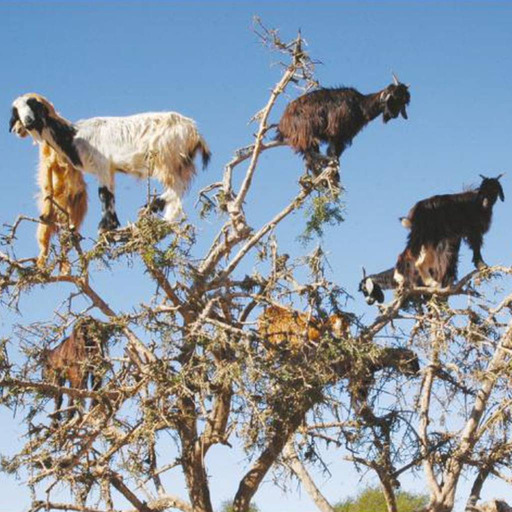

# Recipes

This is where I collect recipes. 

----

## Tomato sandwich

It's cheap, it's filling, it's easy. 

### Ingredients

- Bread
- Tomatoes
- Salt
- Mayonaise
- Spices as you see fit

### Instructions

Toast the bread.

Slice the tomato. Typically one per sandwich.

Once bread is toasted, spread mayo on bread. 

Put tomatoes on bread. then salt tomatoes. 

----

## Nachoes

 Cheese + chips = tasty

### Ingredients

- Tortilla chips
- Daiya cheese
- chopped veggies
- cooked ground meat

### Instructions

Put chips on a plate. 

Put chopped veggies and ground meat on top of chips. 

Put Daiya cheese on top. 

Cook in microwave for 2 minutes. 

Serve with salsa.

----

## Curry

 Veggies and sauce cooked deliciously. 

### Ingredients

- Curry mix
- Peppers
- Onions
- Coconut milk
- Spices
- Oil

### Instructions

Put oil in a saucepan. Put onions in and cook for 1 minute. 

Then add spices and curry mix. Cook for another minute. 

Add coconut milk and mix until all ingredients are thoroughly mixed. 

Then add peppers and cook until cooked through. 

----

## Olives For Goats

Sometimes you just want to feed Olives to Goats, right in the Olive Tree.

 Veggies and sauce cooked deliciously. 

### Ingredients

- Olive Tree

### Instructions

Find an Olive Tree with ripe Olives and then just UNLEASH THE GOATS FROM YOUR HERD UPON THE TREES!!! The Goats are great at climbing! Hooray for Goats!

