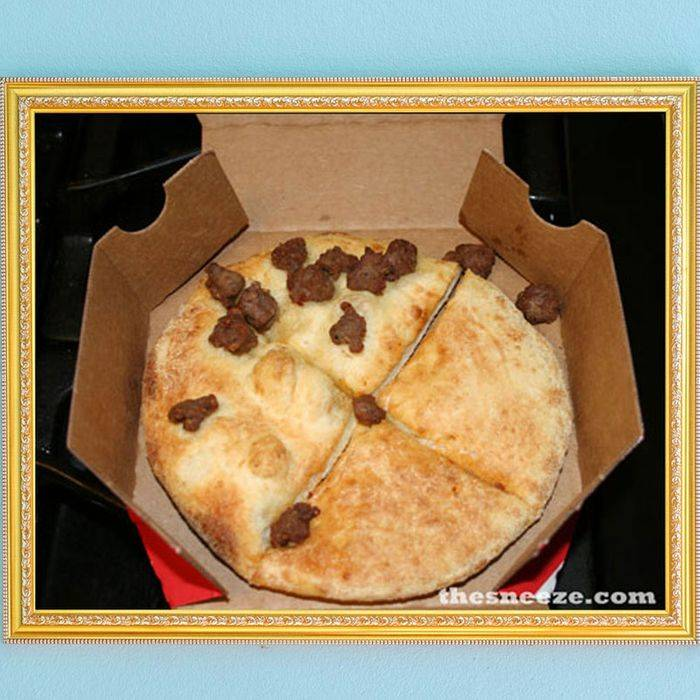

# Recipes

This is where I collect recipes. 

----

## Tomato sandwich

It's cheap, it's filling, it's easy. 

### Ingredients

- Bread
- Tomatoes
- Salt
- Mayonaise
- Spices as you see fit

### Instructions

Toast the bread.

Slice the tomato. Typically one per sandwich.

Once bread is toasted, spread mayo on bread. 

Put tomatoes on bread. then salt tomatoes. 

----

## None pizza with left beef

 Pizza = none. Beef = left

### Ingredients

- Pizza dough
- cooked beef

### Instructions

Cook pizza dough. Do not add sauce. 

Add beef to left side of cooked pizza dough. Beef is only for the left side, do not put anywhere else. 

----

## Nachoes

 Cheese + chips = tasty

### Ingredients

- Tortilla chips
- Daiya cheese
- chopped veggies
- cooked ground meat

### Instructions

Put chips on a plate. 

Put chopped veggies and ground meat on top of chips. 

Put Daiya cheese on top. 

Cook in microwave for 2 minutes. 

Serve with salsa.

----

## Curry

 Veggies and sauce cooked deliciously. 

### Ingredients

- Curry mix
- meat of choice
- Peppers
- Onions
- Coconut milk
- Spices
- Oil

### Instructions

Put oil in a saucepan. Cook meat until it is cooked all the way through but not browned. 

Take meat out and store on a plate. 

Put onions in and cook for 1 minute. 

Then add spices and curry mix. Cook for another minute. 

Add coconut milk and mix until all ingredients are thoroughly mixed. 

Then add peppers and cook until cooked through. 

Once peppers are cooked, add meat. Cook for another 2 minutes. 

Let cool and serve on top of rice. 

---

## Sushi

### Ingredients

- Calrose or other sticky rice
- Sushi seasoning powder
	- Or combine rice vinegar, salt, and sugar
- Seaweed wrap (nori)
- Wasabi or horseraddish
	- If using powder, mix with water in advance to form a paste
- Fillings of choice, e.g.
	- Vegetables: avocado, cucumber, carrots
	- Meat: tuna, crab, chicken
	- Extras: green onions, cream cheese
	- Toppings: sriracha, unagi sauce, mayonnaise, sesame seeds

Note that your fish need not be raw!

#### Example sushi combinations:

- **California roll**: inside-out roll with crab salad, and avocado, and cucumber.
- **Philedelphia roll**: smoked or raw salmon with cream cheese.
- **Caterpillar roll**: an inside-out roll with slices of avocado pressed on top.

### Kitchen supplies

- Very wide bowl
- Flat spoon or paddle
- Bamboo sushi roller or plastic wrap
- Very sharp knife (non-serrated)

Avoid using metal bowls and utensils, as the vinegar in the sushi seasoning might react to them.

### Instructions

1. Cook the rice according to its instructions. You may need to wash the rice one or more times (until the water runs clear).
2. Meanwhile, slice fillings into narrow strips. The pieces should not be longer than the nori is wide.
3. When the rice is done, spread it out into a wide container. Sprinkle the sushi seasoning on top and mix gently with a paddle. (Don't crush the rice!)
4. Place nori squares atop a bamboo sushi roller or piece of plastic wrap, shiny side down.
5. Spread one cup of rice onto each nori square, leaving approximately 1cm of non-riced nori on the top.
	- TIP: wet your hands before handling sushi rice.
6. Spread the wasabi or horseradish paste across the roll from side to side in the middle of the roll. Place several strips of ingredients in a line in the same place.
7. Use the sushi roller or plastic wrap to curl the roll, starting from the bottom. Squeeze the ingredients tightly as you go or the roll might fall apart when cut.
8. Wet a very sharp knife and cut the roll into 1/2 cm slices. Wipe down and re-wet the knife occasionally for best results. Make sure you cut all the way through.
9. Apply any desired toppings and serve with soy sauce and/or wasabi paste.

----

## Healing Potion

For when your health drops down. 

### Ingredients

- potion base
- food coloring
- glass jar to hold potion in
- healing ingredients

### Instructions

Put potion base in a pot. Heat on medium heat. 

Add desired healing ingredients. 

Blend in pot. 

Add food coloring. 

Wait until mixture is cool. Then add in glass jar. Cork and save for when you're in the middle of battle. 

----

## Olives For Goats

Sometimes you just want to feed Olives to Goats, right in the Olive Tree.

 Veggies and sauce cooked deliciously. 

### Ingredients

- Olive Tree

### Instructions

Find an Olive Tree with ripe Olives and then just UNLEASH THE GOATS FROM YOUR HERD UPON THE TREES!!! The Goats are great at climbing! Hooray for Goats!

